# ClearPath RAG Platform

> **Ground every clinical answer in evidence.**
> Full-stack clinical decision support built on the **SQL AI in a Day** workshop. The retrieval + generation pipeline can run either:
> 1. **Python pipeline (default)** — local SQL Server 2017+ for clinical data + OpenRouter REST API for embeddings/chat. No Azure subscription required.
> 2. **Azure SQL stored-procedure pipeline (legacy)** — the original Azure SQL `VECTOR` + `AI_GENERATE_EMBEDDINGS` + `sp_invoke_external_rest_endpoint` path from the lab.
>
> Switching between them is a single env var (`AI_PROVIDER=openrouter|azure_python|azure`) — no code changes. The app itself provides the secure web interface, JWT auth, audit logs, and analytics on top of either pipeline.

[](https://fastapi.tiangolo.com)
[](https://react.dev)
[](https://www.microsoft.com/sql-server)
[](https://openrouter.ai)
[](https://www.postgresql.org)
[](https://www.docker.com)

---

## Table of Contents

1. [What is ClearPath?](#what-is-clearpath)
2. [Feature Highlights](#feature-highlights)
3. [Architecture](#architecture)
4. [Screenshot Tour](#screenshot-tour)
5. [Quick Start (Docker)](#quick-start-docker)
6. [Local Development (No Docker)](#local-development-no-docker)
7. [Cloud Deployment](#cloud-deployment)
8. [Environment Variables](#environment-variables)
9. [Database Configuration](#database-configuration)
10. [REST API Reference](#rest-api-reference)
11. [Frontend Pages](#frontend-pages)
12. [Project Structure](#project-structure)
13. [The RAG Pipeline in Detail](#the-rag-pipeline-in-detail)
14. [Testing](#testing)
15. [Troubleshooting](#troubleshooting)
16. [Security Notes](#security-notes)
17. [Community & Support](#community--support)
18. [Contributing](#contributing)
19. [License](#license)

---

## What is ClearPath?

**ClearPath** is a fictional clinical decision support platform from Contoso Health Systems (12 hospitals, 80+ outpatient clinics). It surfaces the **most relevant historical clinical cases** to clinicians at the point of decision — combining:

- **Vector search** (semantic similarity over case embeddings),
- **Full-text keyword search** (lexical recall),
- **Reciprocal Rank Fusion (RRF)** to combine the two,
- **GPT-4o grounded generation** that only answers from the retrieved evidence.

All retrieval and generation runs **inside Azure SQL Database** using native `VECTOR_SEARCH`, `AI_GENERATE_EMBEDDINGS`, and `sp_invoke_external_rest_endpoint`. The application in this repo provides the secure web interface, authentication, audit logs, and analytics.

---

## Feature Highlights

| Area | What's included |
|---|---|
| **Hybrid retrieval** | Vector (cosine) + keyword (FTS) fused with Reciprocal Rank Fusion |
| **Grounded generation** | GPT-4o answers every question only from retrieved cases |
| **Cited evidence** | Every answer shows the supporting case cards (id, age, gender, severity, similarity, distance) |
| **Secure by design** | JWT (HS256, 24h), bcrypt password hashing, RBAC (`admin` / `clinician`), CORS allow-list |
| **Rate limiting** | `slowapi` — 10 RAG queries / minute / IP |
| **Observability** | Structured `structlog` JSON logs, every query persisted with latency + status + user |
| **Analytics** | Daily usage, by-type breakdown, p50 / p95 latency, error rate, success rate |
| **Live config** | RAG defaults (`top_n`, weights, `rrf_k`, `embedding_type`) editable from the UI by admins |
| **Two-database design** | Azure SQL for AI data, PostgreSQL for app metadata — each tool used for what it does best |
| **Modern UI** | React 19 + Vite + TypeScript + Tailwind v4 + Radix UI + Recharts |

---

## Architecture

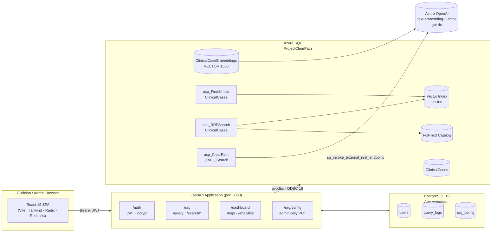
```mermaid
flowchart LR
    subgraph Browser["Clinician / Admin Browser"]
        UI["React 19 SPA<br/>(Vite · Tailwind · Radix · Recharts)"]
    end

    subgraph API["FastAPI Application (port 8000)"]
        Auth["/auth<br/>JWT · bcrypt"]
        RAG["/rag<br/>/query · /search/*"]
        Dash["/dashboard<br/>/logs · /analytics"]
        Cfg["/rag/config<br/>admin-only PUT"]
    end

    subgraph AppDB["PostgreSQL 16<br/>App metadata"]
        Users[(users)]
        Logs[(query_logs)]
        RagCfg[(rag_config)]
    end

    subgraph AzureSQL["Azure SQL<br/>ProjectClearPath"]
        Cases[(ClinicalCases)]
        Emb[(ClinicalCaseEmbeddings<br/>VECTOR 1536)]
        FTS[(Full-Text Catalog)]
        VIdx[(Vector Index<br/>cosine)]
        SP1["usp_FindSimilar<br/>ClinicalCases"]
        SP2["usp_RRFSearch<br/>ClinicalCases"]
        SP3["usp_ClearPath<br/>_RAG_Search"]
    end

    AOAI[("Azure OpenAI<br/>text-embedding-3-small<br/>gpt-4o")]

    UI -- "Bearer JWT" --> API
    API <--> AppDB
    API -- "pyodbc · ODBC 18" --> AzureSQL
    SP1 --> VIdx
    SP2 --> VIdx
    SP2 --> FTS
    SP3 -- "sp_invoke_external_rest_endpoint" --> AOAI
    Emb --> AOAI
```

### Why two databases?

| Database | What it stores | Why |
|---|---|---|
| **Azure SQL** | `ClinicalCases`, `ClinicalCaseEmbeddings`, full-text catalog, vector index, three stored procedures | Native `VECTOR(1536)` type, `AI_GENERATE_EMBEDDINGS`, `VECTOR_SEARCH`, `sp_invoke_external_rest_endpoint` — the entire RAG pipeline runs here as T-SQL |
| **PostgreSQL** | `users`, `query_logs`, `rag_config` | Standard relational workload, low operational burden, used for what relational databases are good at |

### Five-step RAG pipeline

1. **Embed the question** with `AI_GENERATE_EMBEDDINGS` → 1536-dim vector.
2. **Vector search** the ANN index (`VECTOR_SEARCH ... METRIC='cosine'`).
3. **Keyword search** the full-text index (`CONTAINSTABLE`).
4. **Reciprocal Rank Fusion** scores both rankings with configurable weights (`vector_weight=0.6`, `keyword_weight=0.4`, `rrf_k=60`).
5. **GPT-4o generation** receives the top-N cases as context and answers strictly from that evidence.

---

## Screenshot Tour

### Authentication

| Login | Register |
|:---:|:---:|
| 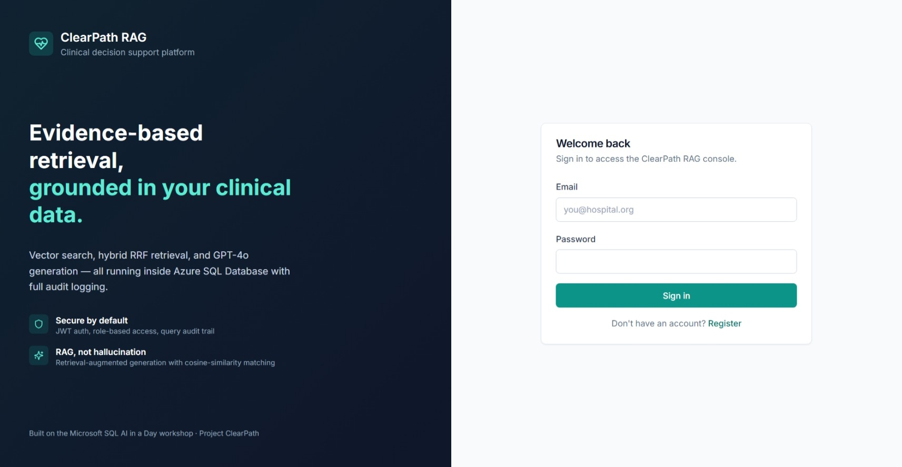 | 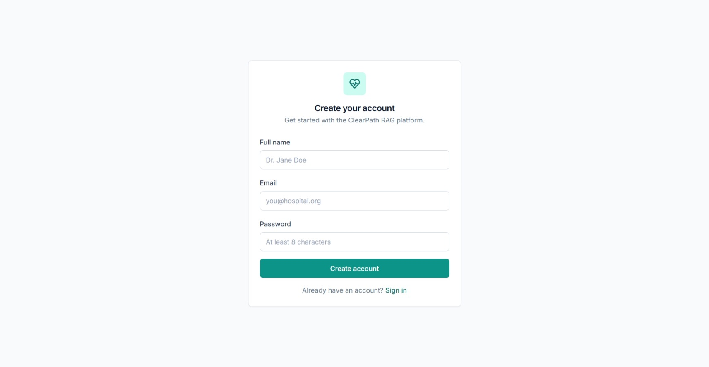 |

### Clinician dashboard

The dashboard gives clinicians an at-a-glance view of recent activity and platform health.

| Dashboard | Dashboard alternate |
|:---:|:---:|
| 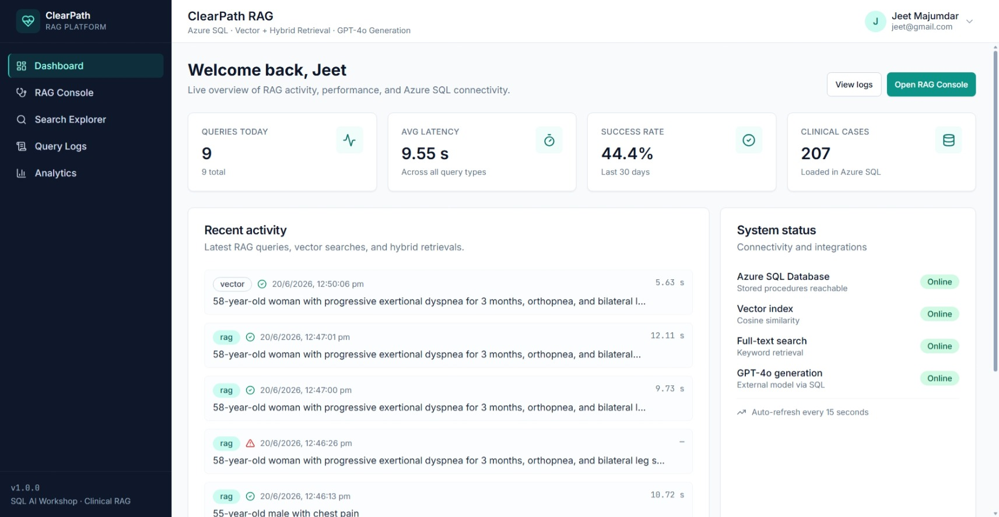 | 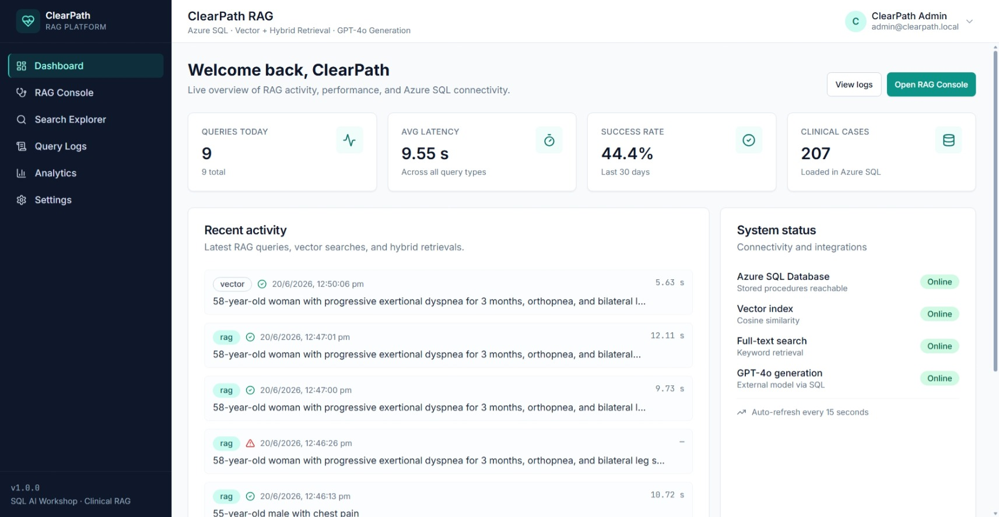 |

### RAG console

The headline feature — submit a patient description and a keyword hint, get grounded cases + a clinical summary.

| Console (form) | Retrieved cases |
|:---:|:---:|
| 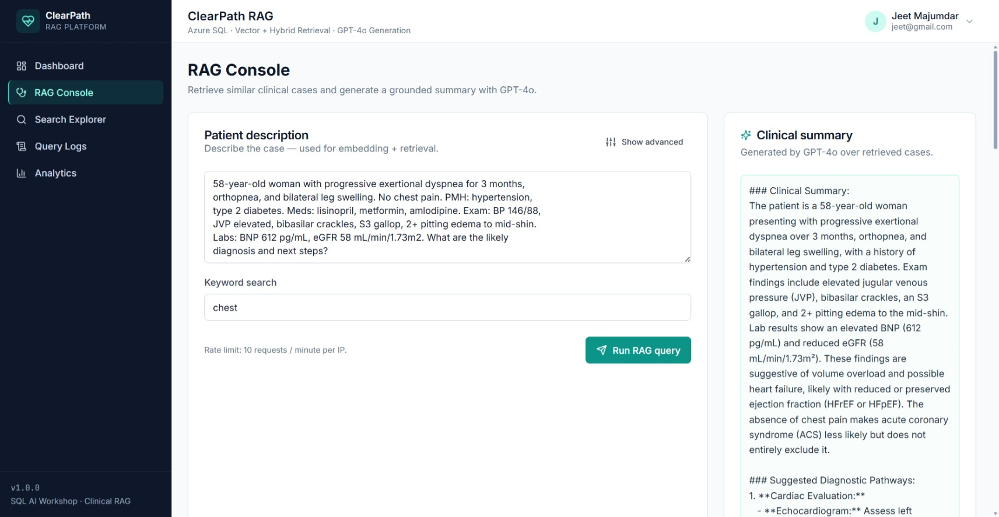 | 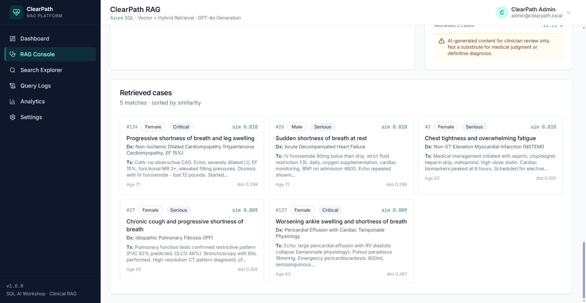 |
| 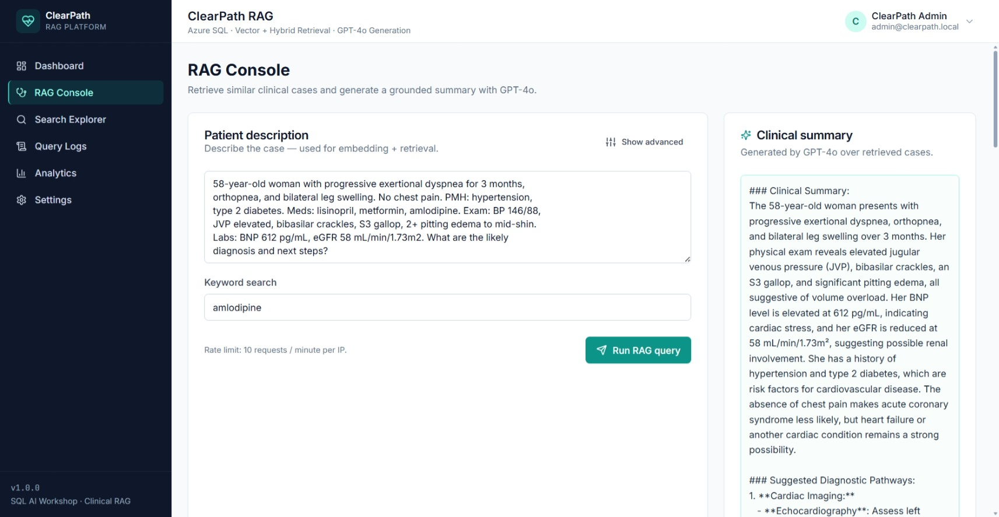 | 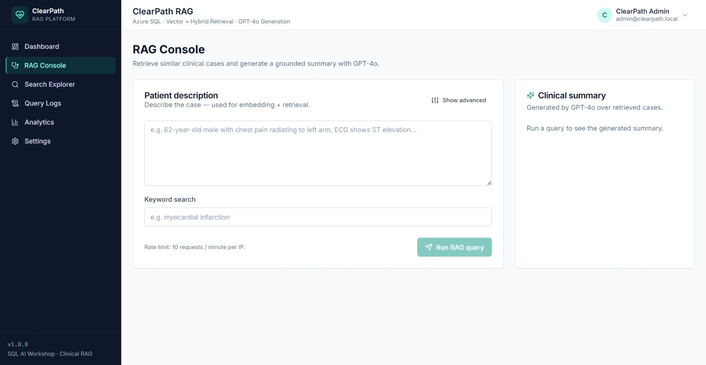 |

### Search explorer

Side-by-side **vector** vs **hybrid (RRF)** search with sliders for live weighting.

| Search results | Empty state |
|:---:|:---:|
| 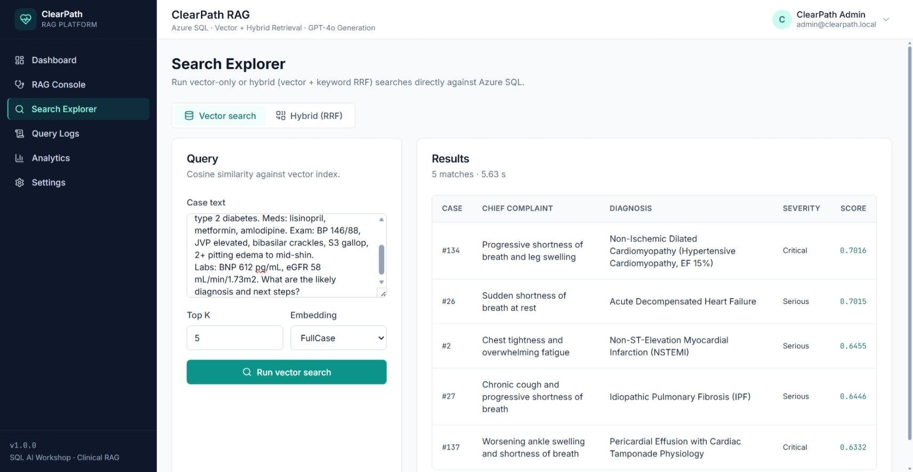 | 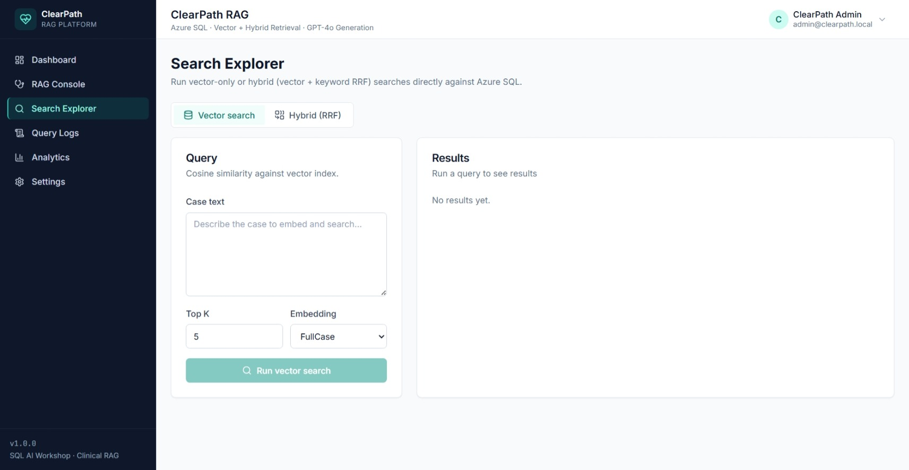 |

### Query logs

Audit every query: who asked what, when, with which weights, and how long it took.

| Logs (filtered) | Logs (initial) |
|:---:|:---:|
| 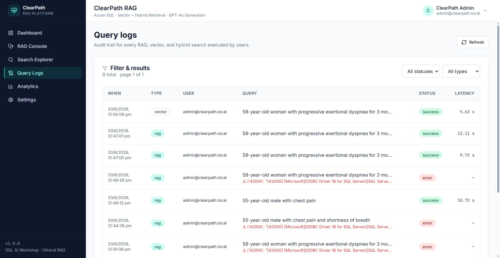 | 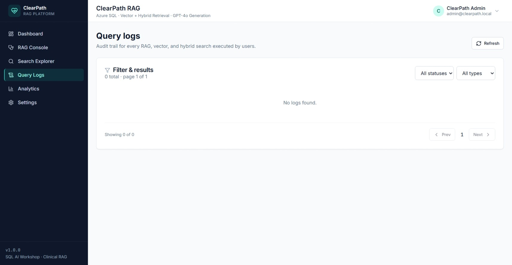 |

### Analytics

Recharts visualizations of usage, latency percentiles, and by-type breakdown.

| Analytics dashboard | By-type breakdown |
|:---:|:---:|
| 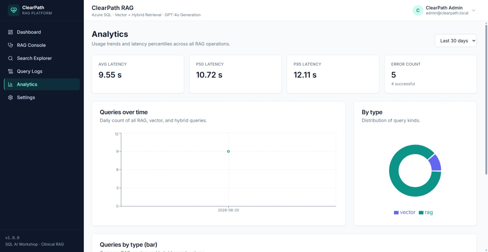 | 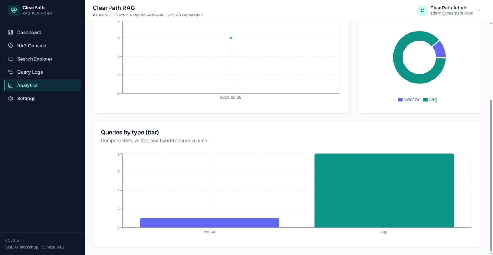 |
| 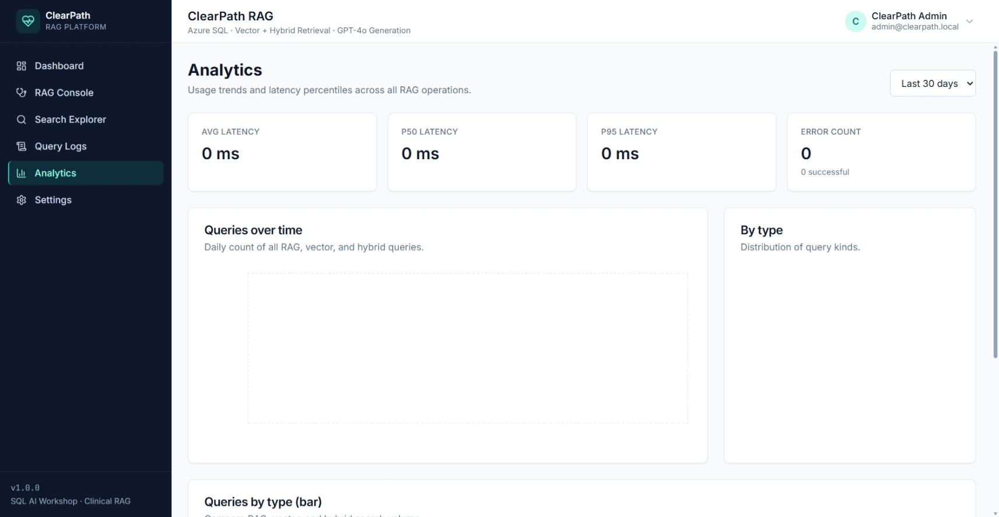 | |

### Admin settings

Admins can edit the live RAG defaults used for every query.

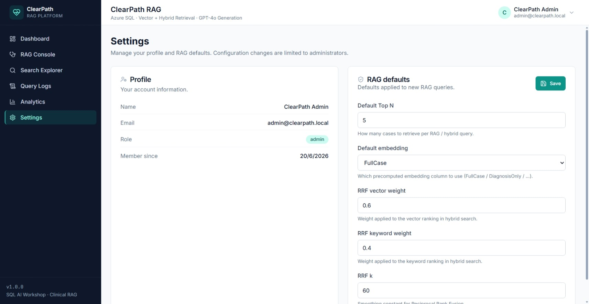

---

## Quick Start (Docker)

The fastest path from zero to running app.

### 1. Prerequisites

- **Docker Desktop** (or Docker Engine + Compose v2)
- **Azure SQL Database** named `ProjectClearPath` with the schema from `sql/` applied (see [Database Configuration](#database-configuration))
- **Azure OpenAI** resource with two deployments:
  - `text-embedding-3-small`
  - `gpt-4o`

### 2. Configure environment

```bash
cp .env.example .env
```

Open `.env` and replace the placeholder values. At minimum, you must set:

```dotenv
SECRET_KEY=<run: openssl rand -hex 32>

SQL_SERVER=your-server.database.windows.net
SQL_DATABASE=ProjectClearPath
SQL_USERNAME=SQLAdmin
SQL_PASSWORD=<your-sql-password>

AZURE_OPENAI_ENDPOINT=https://your-resource.openai.azure.com
AZURE_OPENAI_CHAT_TARGET_URI=https://your-resource.openai.azure.com/openai/deployments/gpt-4o/chat/completions?api-version=2025-01-01-preview
DB_SCOPED_CREDENTIAL_NAME=https://your-resource.openai.azure.com

ADMIN_EMAIL=admin@clearpath.local
ADMIN_PASSWORD=<choose-a-strong-one>
```

> See the full [Environment Variables](#environment-variables) table for every key and its purpose.

### 3. Bring up the stack

```bash
docker compose up --build
```

This starts three containers:

| Service | Image | Port | Purpose |
|---|---|---|---|
| `postgres` | `postgres:16-alpine` | `5432` (internal) | App metadata (users, logs, config) |
| `backend` | `./backend` (built locally) | `8000` | FastAPI REST API |
| `frontend` | `./frontend` (built locally) | `5173` | React SPA |

### 4. Initialize the database & admin user

In a second terminal:

```bash
# Apply Alembic migrations to PostgreSQL
docker compose exec backend alembic upgrade head

# Seed the default admin user + RAG config defaults
docker compose exec backend python -m app.scripts.seed_admin
```

### 5. Open the app

| URL | What it is |
|---|---|
| <http://localhost:5173> | ClearPath web app |
| <http://localhost:8000/docs> | Interactive Swagger UI for the API |
| <http://localhost:8000/redoc> | ReDoc API reference |
| <http://localhost:8000/api/v1/health> | Health check endpoint |

Sign in with the `ADMIN_EMAIL` / `ADMIN_PASSWORD` from `.env`. Register additional clinician accounts from the **Register** page or have your admin create them via `POST /api/v1/auth/register`.

### 6. Tear down

```bash
docker compose down              # stop containers, keep data volume
docker compose down -v           # also delete the postgres_data volume
```

### Convenience targets

```bash
make up        # docker compose up --build
make down      # docker compose down
make migrate   # alembic upgrade head (in backend container)
make seed      # create admin user + default RAG config
make logs      # tail logs from all services
make test      # run backend pytest suite
```

---

## Local Development (No Docker)

Useful when you want hot-reload on both the API and the UI.

### Backend

```bash
cd backend
python -m venv .venv

# Activate:
#   Windows (PowerShell):  .venv\Scripts\Activate.ps1
#   macOS / Linux:         source .venv/bin/activate

pip install --upgrade pip
pip install -r requirements.txt

# PostgreSQL — easiest path is still the docker postgres service:
docker run -d --name clearpath-pg \
  -e POSTGRES_DB=clearpath_app \
  -e POSTGRES_USER=clearpath \
  -e POSTGRES_PASSWORD=clearpath_dev_password \
  -p 5432:5432 \
  postgres:16-alpine

# ODBC Driver 18 — install before running Alembic / the API
# Ubuntu / Debian
curl https://packages.microsoft.com/keys/microsoft.asc | sudo apt-key add -
curl https://packages.microsoft.com/config/ubuntu/$(lsb_release -rs)/prod.list | \
  sudo tee /etc/apt/sources.list.d/mssql-release.list
sudo apt-get update
sudo ACCEPT_EULA=Y apt-get install -y msodbcsql18 unixodbc-dev

# macOS
brew tap microsoft/mssql-release https://github.com/Microsoft/homebrew-mssql-release
brew update
HOMEBREW_ACCEPT_EULA=Y brew install msodbcsql18 mssql-tools18

# Windows — download and install:
# https://learn.microsoft.com/sql/connect/odbc/download-odbc-driver-for-sql-server

# Apply migrations and seed
alembic upgrade head
python -m app.scripts.seed_admin

# Start the API with hot-reload
uvicorn app.main:app --reload --host 0.0.0.0 --port 8000
```

### Frontend

```bash
cd frontend
npm install
npm run dev
# Vite serves at http://localhost:5173
```

The frontend reads `VITE_API_URL` from `frontend/.env` (create one if needed). Default is `http://localhost:8000`.

### Production build

```bash
cd frontend
npm run build      # outputs to frontend/dist
npm run preview    # serve the built bundle locally
```

---

## Cloud Deployment

ClearPath is a standard three-tier web app. The reference architecture deploys to **Azure Container Apps** (backend) + **Azure Static Web Apps** (frontend) + the existing **Azure SQL** + **PostgreSQL Flexible Server**.

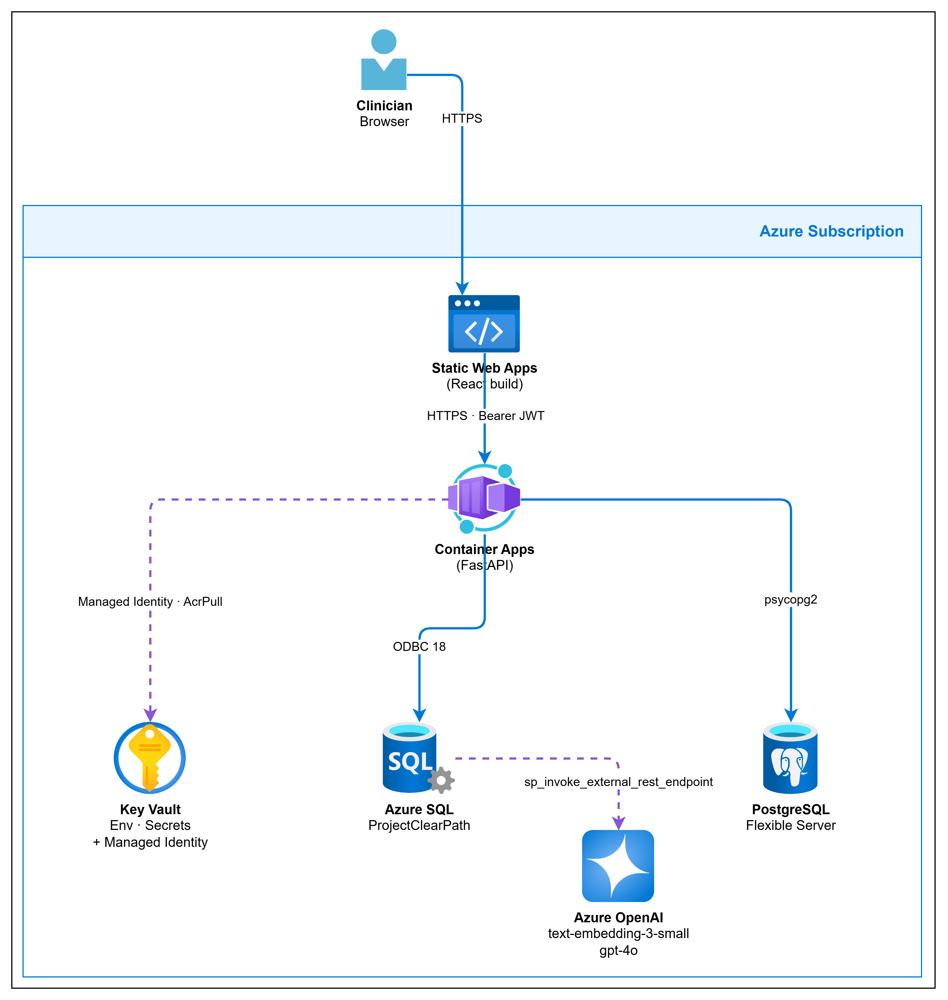

<details>
<summary><b>View as Mermaid (text source)</b></summary>

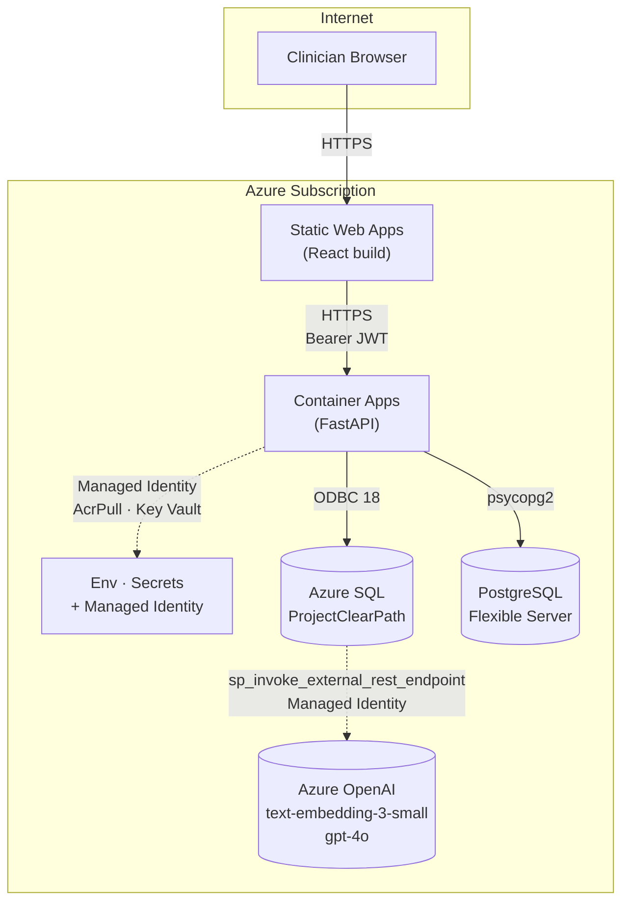
```mermaid
flowchart TB
    subgraph Internet
        User["Clinician Browser"]
    end

    subgraph Azure["Azure Subscription"]
        SWA["Static Web Apps<br/>(React build)"]
        ACA["Container Apps<br/>(FastAPI)"]
        FWD["Env · Secrets<br/>+ Managed Identity"]
        SQL[("Azure SQL<br/>ProjectClearPath")]
        PG[("PostgreSQL<br/>Flexible Server")]
        AOAI[("Azure OpenAI<br/>text-embedding-3-small<br/>gpt-4o")]
    end

    User -->|"HTTPS"| SWA
    SWA -->|"HTTPS<br/>Bearer JWT"| ACA
    ACA -->|"ODBC 18"| SQL
    ACA -->|"psycopg2"| PG
    SQL -.->|"sp_invoke_external_rest_endpoint<br/>Managed Identity"| AOAI
    ACA -.->|"Managed Identity<br/>AcrPull · Key Vault"| FWD
```

</details>

### Option A — Azure Container Apps + Static Web Apps (recommended)

1. **Push images** to Azure Container Registry:

   ```bash
   az acr create --name clearpathacr --sku Basic --admin-enabled true
   az acr login --name clearpathacr
   docker tag clearpath-backend clearpathacr.azurecr.io/backend:v1
   docker push clearpathacr.azurecr.io/backend:v1
   ```

2. **Deploy backend to Container Apps**:

   ```bash
   az containerapp up \
     --name clearpath-backend \
     --resource-group clearpath-rg \
     --environment clearpath-env \
     --image clearpathacr.azurecr.io/backend:v1 \
     --target-port 8000 \
     --ingress external \
     --env-vars \
       POSTGRES_HOST=<pg-flex-fqdn> \
       POSTGRES_PASSWORD=<secret-from-keyvault> \
       SQL_SERVER=<sql-fqdn> \
       SQL_PASSWORD=<secret-from-keyvault> \
       AZURE_OPENAI_ENDPOINT=<endpoint> \
       SECRET_KEY=<secret-from-keyvault>
   ```

3. **Deploy frontend to Static Web Apps**:
   - Connect the repo in the Azure Portal → Static Web Apps → Create.
   - Build preset: **Vite**.
   - App location: `frontend`.
   - Output location: `dist`.
   - Set `VITE_API_URL` to the Container Apps FQDN.
   - Add a rewrite/proxy rule from `/api/*` to the backend if you want a single domain.

4. **Wire up Managed Identity** for the Container App:
   - Grant the identity **AcrPull** on the registry.
   - Grant the SQL managed identity **Cognitive Services OpenAI User** on the Azure OpenAI resource (so `sp_invoke_external_rest_endpoint` works).

### Option B — App Service for Linux (backend) + Static Web Apps (frontend)

```bash
az webapp create \
  --name clearpath-backend \
  --resource-group clearpath-rg \
  --plan clearpath-plan \
  --runtime "PYTHON:3.12" \
  --deployment-container-image-name clearpathacr.azurecr.io/backend:v1

az webapp config appsettings set \
  --name clearpath-backend \
  --resource-group clearpath-rg \
  --settings \
    POSTGRES_HOST=<pg-flex-fqdn> \
    SQL_SERVER=<sql-fqdn> \
    SECRET_KEY=<secret> \
    WEBSITES_PORT=8000
```

### Option C — Azure Developer CLI (`azd`)

The repo is structured for `azd` provisioning. Add an `azure.yaml` and an `infra/` Bicep template, then:

```bash
azd auth login
azd provision    # create RG, ACR, ACA env, PG flexible, secrets
azd deploy       # build + push + release
```

### Production checklist

- [ ] `APP_ENV=production`
- [ ] `SECRET_KEY` is a 32+ byte random value from Key Vault
- [ ] `CORS_ORIGINS` is the exact Static Web Apps URL (no wildcard)
- [ ] `SQL_TRUST_SERVER_CERTIFICATE=no` (use the public CA chain)
- [ ] PostgreSQL is **Azure DB for PostgreSQL Flexible Server** with TLS required
- [ ] Secrets live in **Key Vault**, mounted as Container Apps secrets
- [ ] Container Apps has a managed identity with **AcrPull**
- [ ] SQL managed identity has **Cognitive Services OpenAI User** on the AOAI resource
- [ ] HTTPS only, minimum TLS 1.2
- [ ] Application Insights (or similar) wired to the backend for production telemetry
- [ ] Rate-limit `slowapi` may need a shared backend (Redis) if you scale beyond one replica

---

## Environment Variables

All variables live in the root `.env` file (loaded by both the backend container and docker compose). Frontend variables use the `VITE_` prefix and are baked at build time.

### Application

| Key | Default | Purpose |
|---|---|---|
| `APP_NAME` | `ClearPath RAG` | Display name in logs + UI |
| `APP_ENV` | `development` | `development` / `production` — affects log verbosity |
| `SECRET_KEY` | **required** | HS256 signing key for JWT. Generate with `openssl rand -hex 32` |
| `ACCESS_TOKEN_EXPIRE_MINUTES` | `1440` | JWT lifetime (default = 24h) |
| `CORS_ORIGINS` | `http://localhost:5173` | Comma-separated allowed origins |

### PostgreSQL (app metadata)

| Key | Default | Purpose |
|---|---|---|
| `POSTGRES_HOST` | `postgres` | Hostname (use `localhost` for non-docker local dev) |
| `POSTGRES_PORT` | `5432` | |
| `POSTGRES_DB` | `clearpath_app` | |
| `POSTGRES_USER` | `clearpath` | |
| `POSTGRES_PASSWORD` | `clearpath_dev_password` | |

### Azure SQL (RAG data)

| Key | Default | Purpose |
|---|---|---|
| `SQL_SERVER` | placeholder | `your-server.database.windows.net` |
| `SQL_DATABASE` | `ProjectClearPath` | |
| `SQL_USERNAME` | `SQLAdmin` | Or use AAD-only auth and switch the connection string |
| `SQL_PASSWORD` | placeholder | |
| `SQL_DRIVER` | `ODBC Driver 18 for SQL Server` | |
| `SQL_ENCRYPT` | `yes` | Required for Azure SQL |
| `SQL_TRUST_SERVER_CERTIFICATE` | `no` | Use `yes` only with self-signed certs in dev |

### Azure OpenAI

| Key | Default | Purpose |
|---|---|---|
| `AZURE_OPENAI_ENDPOINT` | placeholder | e.g. `https://your-resource.openai.azure.com` |
| `AZURE_OPENAI_CHAT_TARGET_URI` | placeholder | Full chat-completions URL with `api-version` |
| `DB_SCOPED_CREDENTIAL_NAME` | placeholder | Database scoped credential name (typically same as endpoint URL) |
| `SQL_MASTER_KEY_PASSWORD` | `AzureSQLAI2026` | Must match the value in `sql/003_master_key_and_credentials.sql` |

### RAG defaults

| Key | Default | Purpose |
|---|---|---|
| `SEARCH_DEFAULT_TOP_N` | `5` | How many cases to retrieve per query |
| `RRF_VECTOR_WEIGHT` | `0.6` | Weight applied to vector rank in RRF fusion |
| `RRF_KEYWORD_WEIGHT` | `0.4` | Weight applied to keyword rank in RRF fusion |
| `RRF_K` | `60` | RRF constant — higher = more uniform weighting |
| `EMBEDDING_TYPE_DEFAULT` | `FullCase` | One of: `FullCase`, `SymptomsOnly`, `DiagnosisOnly`, `ChiefComplaintOnly`, `TreatmentOnly`, `OutcomeOnly` |

> These are the **bootstrap** defaults. Admins can edit them at runtime in the **Settings** page — runtime values live in the `rag_config` table and override the env vars on every query.

### Admin seed (first run only)

| Key | Default | Purpose |
|---|---|---|
| `ADMIN_EMAIL` | `admin@clearpath.local` | Admin login email |
| `ADMIN_PASSWORD` | `Admin123!` | **Change before production** |
| `ADMIN_FULL_NAME` | `ClearPath Admin` | Display name |

### Frontend (baked at build time)

| Key | Default | Purpose |
|---|---|---|
| `VITE_API_URL` | `http://localhost:8000` | Where the SPA sends API requests |

---

## Database Configuration

### 1. PostgreSQL (app metadata)

Runs automatically in docker compose. The first `make migrate` creates three tables:

```
users          (id, email UNIQUE, hashed_password, full_name, role, is_active, created_at)
query_logs     (id, user_id FK→users, query_type, patient_description, keyword_search,
                top_n, embedding_type, vector_weight, keyword_weight, latency_ms,
                status, error_message, created_at)
rag_config     (id, key UNIQUE, value, updated_by FK→users, updated_at)
```

### 2. Azure SQL (RAG data)

You must provision Azure SQL **before** starting the app. The full migration is ten idempotent scripts under `sql/`. Run them in order in SSMS, Azure Data Studio, or `sqlcmd`:

| # | File | What it does |
|---|---|---|
| 001 | `001_schema_clinical_cases.sql` | Creates `dbo.ClinicalCases` + bulk-inserts the sample data from `data/ClinicalCases.csv` |
| 002 | `002_fulltext_search_setup.sql` | Creates `ClinicalCasesFTCatalog` full-text index over chief complaint, symptoms, history, diagnosis, treatment, outcome |
| 003 | `003_master_key_and_credentials.sql` | Creates the database master key and the database-scoped credential that uses **Managed Identity** to talk to Azure OpenAI |
| 004 | `004_external_embedding_model.sql` | Registers the `text-embedding-3-small` model via `CREATE EXTERNAL MODEL` |
| 005 | `005_embeddings_table_and_generation.sql` | Creates `dbo.ClinicalCaseEmbeddings VECTOR(1536)` and generates `FullCase` + `SymptomsOnly` embeddings for every case |
| 006 | `006_vector_index.sql` | Creates the ANN vector index (`METRIC = 'cosine'`) |
| 007 | `007_usp_find_similar_cases.sql` | `usp_FindSimilarClinicalCases` — pure vector search |
| 008 | `008_usp_rrf_hybrid_search.sql` | `usp_RRFSearchClinicalCases` — RRF fusion of vector + keyword |
| 009 | `009_usp_rag_search.sql` | `usp_ClearPath_RAG_Search` — full RAG: retrieve → GPT-4o → summary |
| 010 | `010_verification_queries.sql` | Sanity checks (object existence, row counts) — read-only |

Before running scripts 003, 004, 005, 009:

1. **Replace placeholders** in each file with your values:
   - `https://your-resource.openai.azure.com`
   - Chat completions URL (with `api-version=2025-01-01-preview`)
   - Embeddings URL (with `api-version=2024-06-01`)
2. **Grant the SQL Server's managed identity** the **Cognitive Services OpenAI User** role on the Azure OpenAI resource.
3. Verify with `SELECT * FROM sys.database_scoped_credentials;` and `SELECT * FROM sys.external_models;`.

### Sample data

`data/ClinicalCases.csv` ships 207 sample clinical cases (STEMI, NSTEMI, pulmonary embolism, stroke, dyspnea, etc.). `data/ClinicalCaseEmbeddings.csv` is the corresponding 1536-dim embeddings (414 rows = 207 cases × 2 types) in case you want to bulk-load pre-computed vectors instead of generating them.

---

## REST API Reference

Base URL: `http://localhost:8000/api/v1` · Interactive docs: `/docs`

### Auth

| Method | Path | Auth | Description |
|---|---|---|---|
| `POST` | `/auth/register` | public | Create clinician account |
| `POST` | `/auth/login` | public | OAuth2 form login → JWT |
| `GET` | `/auth/me` | bearer | Current user |

### RAG

| Method | Path | Auth | Rate limit | Description |
|---|---|---|---|---|
| `POST` | `/rag/query` | bearer | **10/min/IP** | Full RAG — returns cases + clinical summary |
| `POST` | `/rag/search/vector` | bearer | — | Vector-only retrieval |
| `POST` | `/rag/search/hybrid` | bearer | — | Hybrid (RRF) retrieval |
| `GET` | `/rag/config` | bearer | — | Read live RAG defaults |
| `PUT` | `/rag/config` | admin | — | Update live RAG defaults |

### Dashboard · Logs · Analytics

| Method | Path | Description |
|---|---|---|
| `GET` | `/dashboard/overview` | Queries today · total · avg latency · success rate · clinical case count · Azure SQL connectivity |
| `GET` | `/logs?page=1&page_size=20&status=&query_type=` | Paginated audit log (joined with user email) |
| `GET` | `/analytics/usage?days=30` | Daily volume + by-type breakdown |
| `GET` | `/analytics/performance?days=30` | avg / p50 / p95 latency + success + error counts |

### Health

| Method | Path | Description |
|---|---|---|
| `GET` | `/health` | Public — `{ status, azure_sql_connected }` |

### Error envelope

All errors return:

```json
{ "detail": "Human-readable error message" }
```

Common codes:

| Code | When |
|---|---|
| `400` | Validation / duplicate email |
| `401` | Missing or invalid bearer token |
| `403` | Authenticated but not allowed (e.g. clinician hitting admin endpoint) |
| `422` | Pydantic validation error (request body shape) |
| `429` | Rate-limited (RAG query exceeded 10/min/IP) |
| `500` | Unhandled server error |
| `502` | Upstream stored-procedure failure |

---

## Frontend Pages

| Path | Component | Auth | Description |
|---|---|---|---|
| `/` | `Landing` | public | Marketing page with feature overview |
| `/login` | `Login` | public | Email + password sign-in |
| `/register` | `Register` | public | Create clinician account |
| `/app/dashboard` | `Dashboard` | any user | KPIs + recent activity + system status |
| `/app/chat` | `Chat` | any user | Conversational Q&A with retrieval settings |
| `/app/rag` | `RagConsole` | any user | Structured form: patient description + keywords → cases + summary |
| `/app/search` | `SearchExplorer` | any user | Vector vs hybrid side-by-side with sliders |
| `/app/logs` | `Logs` | any user | Paginated audit log with filters |
| `/app/analytics` | `Analytics` | any user | Recharts: usage, latency, by-type |
| `/app/settings` | `Settings` | admin only | Profile + editable live RAG defaults |

---

## Project Structure

```
.
├── docker-compose.yml          # postgres + backend + frontend
├── Makefile                    # up / down / build / migrate / seed / logs / test
├── .env.example                # template — copy to .env
├── README.md                   # you are here
│
├── backend/                    # FastAPI app
│   ├── Dockerfile
│   ├── requirements.txt
│   ├── pytest.ini
│   ├── alembic.ini
│   ├── alembic/
│   │   ├── env.py
│   │   └── versions/001_initial_schema.py
│   ├── app/
│   │   ├── main.py             # FastAPI app, CORS, slowapi, /health
│   │   ├── core/
│   │   │   ├── config.py       # pydantic-settings, env loading
│   │   │   └── security.py     # bcrypt, JWT (HS256)
│   │   ├── db/
│   │   │   ├── base.py         # DeclarativeBase
│   │   │   ├── session.py      # SQLAlchemy engine + SessionLocal + get_db
│   │   │   └── azure_sql.py    # pyodbc context manager
│   │   ├── models/             # User · QueryLog · RagConfig + enums
│   │   ├── schemas/            # Pydantic request/response models
│   │   ├── api/
│   │   │   ├── deps.py         # OAuth2PasswordBearer + get_current_user + require_admin
│   │   │   └── v1/             # auth · rag · dashboard · logs · analytics
│   │   ├── services/
│   │   │   ├── auth_service.py
│   │   │   ├── rag_service.py  # pyodbc → stored procedures
│   │   │   └── analytics_service.py
│   │   └── scripts/
│   │       ├── seed_admin.py   # idempotent admin + RAG defaults
│   │       └── inspect_sps.py  # dump SP bodies for debugging
│   └── tests/                  # pytest — in-memory SQLite + mocked Azure SQL
│       ├── conftest.py
│       ├── test_security.py
│       ├── test_auth.py
│       ├── test_rag.py
│       ├── test_dashboard_logs.py
│       └── README.md
│
├── frontend/                   # React 19 + Vite + TS + Tailwind v4
│   ├── Dockerfile
│   ├── package.json
│   ├── vite.config.ts
│   ├── tsconfig.{json,app,node}.json
│   ├── eslint.config.js
│   ├── index.html
│   └── src/
│       ├── main.tsx            # QueryClient + BrowserRouter + StrictMode
│       ├── App.tsx             # routing
│       ├── index.css           # Tailwind + design tokens
│       ├── contexts/
│       │   └── AuthContext.tsx # login · register · logout · me
│       ├── lib/
│       │   ├── api.ts          # axios + bearer interceptor + 401 redirect
│       │   ├── types.ts        # mirrors backend Pydantic
│       │   └── utils.ts        # cn · formatLatency · formatDate · truncate
│       ├── components/
│       │   ├── layout/         # AppShell · Sidebar · TopBar · ProtectedRoute
│       │   └── ui/             # Button · Card · Input · Badge · Feedback · Label · Select · Table
│       └── pages/              # Landing · Login · Register · Dashboard · Chat · RagConsole
│                               # · SearchExplorer · Logs · Analytics · Settings
│
├── sql/                        # Azure SQL migrations (run 001–010 in order)
│   ├── README.md
│   ├── 001_schema_clinical_cases.sql
│   ├── 002_fulltext_search_setup.sql
│   ├── 003_master_key_and_credentials.sql
│   ├── 004_external_embedding_model.sql
│   ├── 005_embeddings_table_and_generation.sql
│   ├── 006_vector_index.sql
│   ├── 007_usp_find_similar_cases.sql
│   ├── 008_usp_rrf_hybrid_search.sql
│   ├── 009_usp_rag_search.sql
│   └── 010_verification_queries.sql
│
├── docs/
│   ├── architecture.md         # System architecture + two-DB rationale
│   └── api.md                  # REST API reference
│
├── lab/                        # Original Microsoft "SQL AI in a Day" workshop materials
│   ├── lab1.md … lab7.md       # Step-by-step walkthroughs
│   └── sql.md                  # Cheat sheet of all SQL snippets
│
├── data/                       # Sample data
│   ├── ClinicalCases.csv       # 207 cases
│   └── ClinicalCaseEmbeddings.csv   # 414 pre-computed vectors
│
└── images/                     # 17 screenshots used throughout this README
```

---

## The RAG Pipeline in Detail

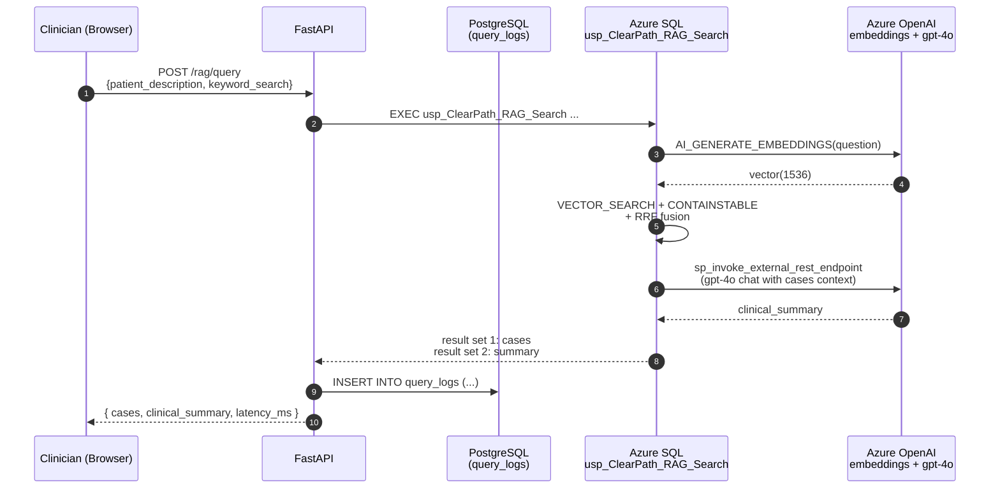
```mermaid
sequenceDiagram
    autonumber
    participant U as Clinician (Browser)
    participant API as FastAPI
    participant PG as PostgreSQL<br/>(query_logs)
    participant SQL as Azure SQL<br/>usp_ClearPath_RAG_Search
    participant AOAI as Azure OpenAI<br/>embeddings + gpt-4o

    U->>API: POST /rag/query<br/>{patient_description, keyword_search}
    API->>SQL: EXEC usp_ClearPath_RAG_Search ...
    SQL->>AOAI: AI_GENERATE_EMBEDDINGS(question)
    AOAI-->>SQL: vector(1536)
    SQL->>SQL: VECTOR_SEARCH + CONTAINSTABLE<br/>+ RRF fusion
    SQL->>AOAI: sp_invoke_external_rest_endpoint<br/>(gpt-4o chat with cases context)
    AOAI-->>SQL: clinical_summary
    SQL-->>API: result set 1: cases<br/>result set 2: summary
    API->>PG: INSERT INTO query_logs (...)
    API-->>U: { cases, clinical_summary, latency_ms }
```

All of steps 2–6 happen **inside Azure SQL**. The Python app is a thin, secure wrapper.

---

## Testing

The pytest suite uses an **in-memory SQLite database** and **mocks the Azure SQL connection**, so you can run tests with zero external dependencies.

```bash
# Inside Docker
docker compose exec backend pytest -v

# Locally
cd backend
pytest -v
```

Coverage:

| File | Covers |
|---|---|
| `test_security.py` | bcrypt hash round-trip, JWT encode/decode, invalid token rejection |
| `test_auth.py` | register, login, `/auth/me`, duplicate email, weak password, bad credentials |
| `test_rag.py` | vector / hybrid / RAG SP result mapping, RAG query endpoint success + error logging, RAG config get/put + admin-only enforcement |
| `test_dashboard_logs.py` | dashboard overview, paginated logs + filters, usage analytics, performance analytics, `/health` degraded state |

See [`backend/tests/README.md`](backend/tests/README.md) for the SQLite Enum-swap pattern used to make the SQLAlchemy models portable.

---

## Troubleshooting

### `docker compose up` fails immediately

| Symptom | Likely cause | Fix |
|---|---|---|
| `bind: address already in use` on 5432 / 8000 / 5173 | A previous run is still bound | `docker compose down` (add `-v` to wipe the postgres volume) |
| `Cannot connect to the Docker daemon` | Docker Desktop not running | Start Docker Desktop, wait for the whale icon to settle |
| `ERROR: failed to solve: ... msodbcsql18 ...` on backend build | Old Docker / buildx without `--network=host` | `docker compose build --no-cache` after updating Docker Desktop |

### `alembic upgrade head` fails

| Symptom | Likely cause | Fix |
|---|---|---|
| `psycopg2.OperationalError: could not connect to server` | Postgres container not healthy yet | `docker compose ps` until `postgres` says `(healthy)`, then retry |
| `password authentication failed for user "clearpath"` | You changed `POSTGRES_*` after the volume was created | `docker compose down -v` to wipe the volume, then `up` again |
| `relation "users" does not exist` on first call | Migrations weren't run | `docker compose exec backend alembic upgrade head` |

### `seed_admin` complains

| Symptom | Likely cause | Fix |
|---|---|---|
| `Admin user already exists` | Idempotent — already seeded | Safe to ignore, or drop the row manually |
| `ValidationError` on `ADMIN_EMAIL` | Email format invalid in `.env` | Make sure it's a valid email string |
| `Password too short` | `ADMIN_PASSWORD` < 8 chars | Update `.env` to a longer value |

### RAG queries fail with `502 Bad Gateway`

| Symptom | Likely cause | Fix |
|---|---|---|
| `[Microsoft][ODBC Driver 18 for SQL Server]SSL Provider: ... certificate verify failed` | Using `SQL_TRUST_SERVER_CERTIFICATE=no` against a self-signed / private CA cert | Set `SQL_TRUST_SERVER_CERTIFICATE=yes` for dev, or install the proper CA bundle |
| `Login failed for user 'SQLAdmin'` | Wrong `SQL_USERNAME` / `SQL_PASSWORD` | Verify in SSMS with the same credentials |
| `Cannot find either column "dbo" or the user-defined function ...` | Migration `sql/001` not run | Re-run from `sql/001` through `sql/009` in order |
| `External model 'embedding_openai_text3_small' not found` | Migration `sql/004` not run | Run `004` then verify `SELECT * FROM sys.external_models;` |
| `sp_invoke_external_rest_endpoint ... 401 Unauthorized` | SQL managed identity lacks **Cognitive Services OpenAI User** on the AOAI resource | Add the role assignment in the Azure Portal → AOAI → Access Control (IAM) |
| `sp_invoke_external_rest_endpoint ... 404 Not Found` | Wrong `AZURE_OPENAI_CHAT_TARGET_URI` (deployment name or api-version) | Verify the deployment exists in Microsoft Foundry and the URL matches the blade |
| RAG succeeds but `clinical_summary` is empty | GPT-4o throttling / region mismatch | Check AOAI metrics blade; verify the deployment's region matches the SQL DB's outbound allow-list |

### "No clinical cases found"

- Confirm the seed data was bulk-inserted: `SELECT COUNT(*) FROM dbo.ClinicalCases;` should return `>= 207`.
- Confirm embeddings exist: `SELECT COUNT(*) FROM dbo.ClinicalCaseEmbeddings;` should return `>= 414`.
- If the SP returns rows but the frontend shows none, check the browser dev tools — a 502 here usually means `pyodbc` couldn't connect (driver missing or DSN mismatch).

### Frontend can't reach the API

| Symptom | Likely cause | Fix |
|---|---|---|
| `Network Error` / `ERR_CONNECTION_REFUSED` in DevTools | Backend not running, or `VITE_API_URL` wrong | Confirm `http://localhost:8000/api/v1/health` works in your browser. Restart `npm run dev` after editing `frontend/.env` |
| `CORS policy: No 'Access-Control-Allow-Origin' header` | `CORS_ORIGINS` in `.env` doesn't match the frontend origin | Add the exact frontend origin (e.g. `http://localhost:5173`) to `CORS_ORIGINS` and rebuild the backend |
| Login works but every other call returns `401` | Token expired (24h default) or stored user got out of sync | Sign out and back in. Confirm `localStorage.cp_token` in DevTools |
| `403 Forbidden` on Settings save | Logged in as clinician, not admin | Sign in with the admin account from `.env`, or promote the user in PostgreSQL: `UPDATE users SET role='admin' WHERE email='…';` |

### Tests failing locally

| Symptom | Likely cause | Fix |
|---|---|---|
| `ImportError: No module named app` | Ran from outside `backend/` | `cd backend && pytest` |
| `sqlalchemy.exc.OperationalError: no such table` | `conftest.py` not loaded | Make sure `pytest.ini` exists and `testpaths = tests` |
| `bcrypt 5.x compatibility warning` | Newer bcrypt than `4.2.1` pinned in `requirements.txt` | `pip install 'bcrypt==4.2.1'` to match |

### Performance

- **First RAG query is slow (5–10 s)** — expected: GPT-4o cold start, plus embedding lookup. Subsequent queries typically 800 ms – 1.5 s.
- **p95 > 3 s** — check the AOAI deployment's tokens-per-minute limit; you may need to request a quota increase.
- **`clinical_summary` returns immediately but cases are missing** — the SP is timing out. Inspect with `backend/app/scripts/inspect_sps.py` and run the SP manually in SSMS.

### Cleaning up a broken install

```bash
docker compose down -v              # wipe postgres volume
docker image prune -af               # wipe stale backend/frontend images
docker compose up --build           # rebuild from scratch
docker compose exec backend alembic upgrade head
docker compose exec backend python -m app.scripts.seed_admin
```

---

## Security Notes

- **Never commit `.env`** — only `.env.example` is tracked.
- **Rotate** any credentials that appear in plaintext in `lab/` (workshop materials).
- **Set a strong `SECRET_KEY`** in production (≥ 32 random bytes).
- **Use AAD-only authentication** for Azure SQL when possible and remove SQL logins.
- The RAG output carries a **clinical disclaimer** in the UI — ClearPath is decision support, **not a diagnostic device**.
- All RAG queries are rate-limited (`slowapi`, 10/min/IP) — bump this only behind a real WAF / API Gateway.
- The repo includes no PHI — `data/ClinicalCases.csv` is fictional seed data.

---

## Community & Support

ClearPath is a community project — contributions, bug reports, and security
disclosures are all welcome through the channels below.

| If you want to… | Go here |
| --- | --- |
| Ask a "how do I…" question | [GitHub Discussions](../../discussions) |
| Report a bug | [Bug report template](.github/ISSUE_TEMPLATE/bug_report.md) |
| Suggest a feature | [Feature request template](.github/ISSUE_TEMPLATE/feature_request.md) |
| Report a security vulnerability | [`SECURITY.md`](SECURITY.md) (private disclosure) |
| Find a quick fix for a common problem | [`TROUBLESHOOTING.md`](TROUBLESHOOTING.md) |
| See what's changed recently | [`CHANGELOG.md`](CHANGELOG.md) |
| Get help / contact a human | [`SUPPORT.md`](SUPPORT.md) |

> **ClearPath is clinical decision support, not a diagnostic device.** Every
> RAG response carries a clinical disclaimer in the UI. Outputs are generated
> from a finite, fictional case dataset and are a starting point for clinician
> review — not a substitute for it.

---

## Contributing

We welcome pull requests! Before you start, please read:

- [`CONTRIBUTING.md`](CONTRIBUTING.md) — development setup, conventions, the
  pull-request process, and how SQL changes are handled.
- [`CODE_OF_CONDUCT.md`](CODE_OF_CONDUCT.md) — community standards and
  enforcement.
- [`SECURITY.md`](SECURITY.md) — please **do not** file public issues for
  security vulnerabilities.

Project tooling conventions:

- **Python 3.12** (pinned via [`.python-version`](.python-version)).
- **Node 20 LTS** (pinned via [`frontend/.nvmrc`](frontend/.nvmrc)).
- **Editor** settings live in [`.editorconfig`](.editorconfig).
- **Frontend formatting** via Prettier — see [`.prettierrc.json`](.prettierrc.json)
  and [`.prettierignore`](.prettierignore).

---

## License

MIT License. See [LICENSE](LICENSE) for details.
