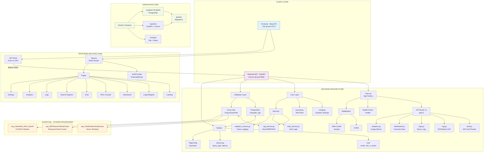

# ClearPath-RAG Architecture Diagram

## Legend
- 🟦 Frontend Components
- 🟪 Backend Components  
- 🟨 Database & Infrastructure
- 🟧 External Services



## Architecture Overview

### 1. **Client Layer**
- **Frontend**: React/TypeScript SPA using Vite, running on port 5173
- **Backend**: FastAPI REST API, running on port 8000

### 2. **Frontend Architecture**
- **State Management**: Context API (`AuthContext`)
- **Routing**: React Router DOM
- **Protected Routes**: Role-based access control (admin/clinician)
- **API Client**: Axios with JWT token interceptor

### 3. **Backend Architecture**
- **Framework**: FastAPI with async support
- **Authentication**: JWT tokens with bcrypt password hashing
- **Rate Limiting**: SlowAPI with per-IP limits (10 req/min for RAG)
- **CORS**: Configurable origins via settings

### 4. **Data Layer**
| Database | Purpose | Tables |
|----------|---------|--------|
| **PostgreSQL** | User/Auth management | users, query_logs, rag_config |
| **Azure SQL** | Clinical cases with vector embeddings | ClinicalCases, Embeddings |

### 5. **RAG Pipeline**
```
User Query → [RAG Service] → Azure SQL Stored Procedures
                                    ├── usp_ClearPath_RAG_Search (full pipeline)
                                    ├── usp_RRFSearchClinicalCases (hybrid)
                                    └── usp_FindSimilarClinicalCases (vector only)
```

### 6. **Configuration**
- Environment variables via `.env` (Pydantic settings)
- RAG parameters: `top_n`, `embedding_type`, `vector_weight`, `keyword_weight`, `rrf_k`
- Default embedding: `FullCase`