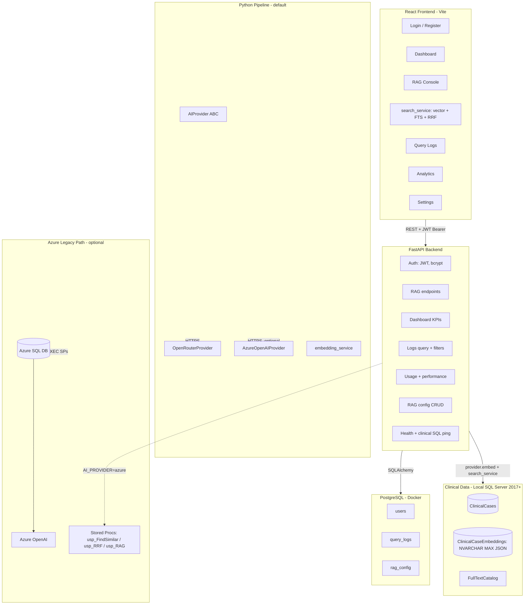
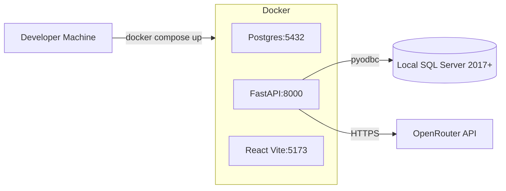
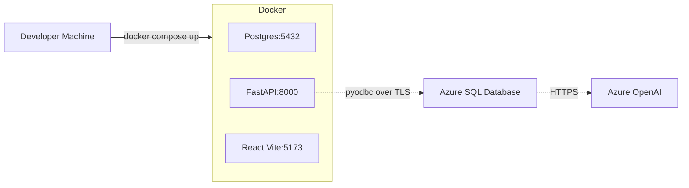

# ClearPath RAG — Architecture

## Overview

ClearPath RAG is a **full-stack clinical decision support platform**. The retrieval and
generation pipeline runs in **Python** by default, with the Azure SQL stored procedure
path preserved as a switchable alternative so the project can be run either against a
local SQL Server + OpenRouter (no Azure required) or against the original Azure SQL + Azure
OpenAI lab setup.

The FastAPI backend provides a secure REST API, JWT auth, and an audit trail; the React
frontend provides the clinician and admin experience.

## High-Level Diagram

## AI Provider Switch

A single environment variable — `AI_PROVIDER` — chooses between three execution paths:

| Mode | Value | Embeddings | Vector Search | FTS / RRF | LLM |
|------|-------|------------|---------------|-----------|-----|
| **Python + OpenRouter** (default) | `openrouter` | OpenRouter `nvidia/llama-nemotron-embed-vl-1b-v2:free` | Python brute-force cosine | `CONTAINSTABLE` + Python RRF | OpenRouter chat (e.g. `nvidia/nemotron-3-super-120b-a12b:free`) |
| **Python + Azure OpenAI** | `azure_python` | Azure OpenAI embeddings | Python brute-force cosine | `CONTAINSTABLE` + Python RRF | Azure OpenAI chat |
| **Azure SQL SP (legacy)** | `azure` | Inside SP via `AI_GENERATE_EMBEDDINGS` | Inside SP via vector index | Inside SP | Inside SP via external model |

Switching modes **requires no code change** — only `.env` and (for the legacy path) the
Azure SQL schema/SQL scripts. See [docs/LOCAL_AI_SETUP.md](LOCAL_AI_SETUP.md) for the
full setup guide and switching instructions.

## Two-Database Pattern

| Concern | Database | Rationale |
|--------|----------|-----------|
| Clinical cases, embeddings, RAG pipeline | **Local SQL Server 2017+** (default) or **Azure SQL** (legacy mode) | Source of truth for domain data. SQL Server has native full-text search and `NVARCHAR(MAX)` JSON storage for embeddings — works on every edition. Azure SQL additionally has native `VECTOR` + `AI_GENERATE_EMBEDDINGS`. |
| Users, sessions, query audit, runtime config | **PostgreSQL** (Docker) | App metadata lives in a portable RDBMS; survives clinical DB migrations; cheap local dev. |
| Auth (JWT signing key, secrets) | env / secret manager | Never in the database. |

The two clinical modes are **mutually exclusive** — you pick one when you run `azd up`
(or `docker compose up`). See `sql/README.md` for which scripts to run in each mode.

## Key Modules

### Backend (`backend/app/`)

| Module | Responsibility |
|--------|----------------|
| `main.py` | FastAPI app, CORS, rate limiting, health endpoint |
| `core/config.py` | pydantic-settings config from `.env` (incl. `AI_PROVIDER`) |
| `core/security.py` | bcrypt hashing, JWT encode/decode |
| `db/azure_sql.py` | pyodbc connection context manager (works for any SQL Server) |
| `db/session.py` | SQLAlchemy session for PostgreSQL |
| `models/` | `User`, `QueryLog`, `RagConfig` ORM models |
| `schemas/` | Pydantic request/response shapes |
| `services/ai_provider.py` | `AIProvider` ABC — `embed`, `embed_batch`, `chat` |
| `services/openrouter_provider.py` | OpenRouter implementation |
| `services/azure_provider.py` | Azure OpenAI implementation (used by both `azure_python` and legacy `azure`) |
| `services/provider_factory.py` | `get_ai_provider()` factory — reads `AI_PROVIDER`, cached |
| `services/embedding_service.py` | Generates + stores embeddings for all cases |
| `services/search_service.py` | Vector cosine, FTS via `CONTAINSTABLE`, RRF fusion — pure Python |
| `services/rag_service.py` | Dispatcher: Python pipeline vs Azure SQL SP path |
| `services/auth_service.py` | Register, authenticate, fetch users |
| `services/analytics_service.py` | KPIs, daily usage, latency percentiles |
| `api/v1/` | Route handlers grouped by domain |
| `scripts/generate_embeddings.py` | CLI to populate embeddings (used in Python mode) |
| `scripts/seed_admin.py` | First-run admin + RAG config seed |

### Frontend (`frontend/src/`)

| Path | Purpose |
|------|---------|
| `lib/api.ts` | Axios instance + JWT interceptor |
| `contexts/AuthContext.tsx` | Login, register, current user, logout |
| `components/layout/AppShell.tsx` | Sidebar + top bar shell |
| `components/ui/*` | shadcn-style primitives (Button, Card, Input, etc.) |
| `pages/*` | One page per top-level nav item |

## RAG Pipeline

### Default: Python pipeline (`AI_PROVIDER=openrouter`)

1. **Query embedding** — `provider.embed(query_text)` returns a 1536-d vector via
   OpenRouter (`nvidia/llama-nemotron-embed-vl-1b-v2:free`).
2. **Vector search** — `search_service.vector_search()` loads every embedding from
   `ClinicalCaseEmbeddings` (`EmbeddingJson` is parsed from JSON), computes cosine
   similarity in pure Python (no numpy required), returns the top-k cases.
3. **Keyword search** — `search_service.keyword_search()` uses
   `CONTAINSTABLE` against the `ClinicalCases` full-text catalog.
4. **Hybrid retrieval (RRF)** — `search_service.hybrid_search()` fuses the two rankings
   with Reciprocal Rank Fusion (`vector_weight * 1/(k+rank_v) + keyword_weight * 1/(k+rank_k)`).
5. **Generation** — `provider.chat(system_prompt, user_prompt)` returns a clinical summary
   grounded in the retrieved cases. The default model is `meta-llama/llama-3.3-70b-instruct:free`.

The web app's job is to:

- Pass clinician input to the service with sane defaults.
- Capture the retrieved cases and the generated summary.
- Persist the call (parameters + latency + status) to `query_logs`.
- Surface failures with the original error from the AI provider.

### Legacy: Azure SQL SP (`AI_PROVIDER=azure`)

1. **Query embedding** — `AI_GENERATE_EMBEDDINGS` produces a vector using the configured
   external Azure OpenAI model (`text-embedding-3-small`).
2. **Vector search** — Cosine similarity over the `ClinicalCaseEmbeddings` vector index
   (Lab 5 procedure: `usp_FindSimilarClinicalCases`).
3. **Keyword search** — `CONTAINS` / `FREETEXT` over the full-text catalog
   (Lab 1 setup + Lab 6 procedure: `usp_RRFSearchClinicalCases`).
4. **Hybrid retrieval (RRF)** — Reciprocal Rank Fusion of vector + keyword rankings.
5. **Generation** — GPT-4o call (external model in SQL) produces a clinical summary
   grounded in the retrieved cases (Lab 7 procedure: `usp_ClearPath_RAG_Search`).

This path is preserved **untouched** for backward compatibility — the Python service
just routes around it when `AI_PROVIDER != "azure"`.

## Security Model

- **JWT (HS256)** with a server-side `SECRET_KEY`; access tokens valid for 24 hours.
- **bcrypt** for password hashing (`passlib`).
- **CORS** restricted to the configured frontend origin(s).
- **Rate limiting** (`slowapi`) on `/rag/query` — 10 req/min per IP.
- **No clinical-SQL credentials reach the browser** — they live in backend env only.
- **Role-based access** — `admin` can update `rag_config`; both roles can query and view logs.
- **Defense in depth** — every AI call is wrapped in try/except and logged with error
  message; the frontend never sees stack traces.

## Deployment Topology

### Local Python pipeline (default)

### Azure legacy

In production you would:

- Replace the dev frontend container with a static build behind a CDN or App Service.
- Replace the FastAPI container with Azure Container Apps or App Service.
- Move PostgreSQL to Azure Database for PostgreSQL Flexible Server.
- Move secrets to Azure Key Vault and reference via managed identity.

## Observability

- **Structured JSON logs** from `structlog` (backend).
- **Dashboard KPIs** — queries today, avg latency, success rate, clinical-DB connectivity.
- **Per-query audit trail** in `query_logs` (who, what, when, how long, success/error).
- **Analytics endpoints** — daily usage, by-type distribution, p50/p95 latency.
- **`/health`** endpoint pings the clinical SQL Server with `SELECT 1`.

## Why This Shape?

- **Default path needs no Azure subscription** — perfect for workshops, offline dev, CI.
- **Switching is one env var** — `AI_PROVIDER=azure` brings the Azure SQL path back online
  for users who want to use the lab's stored procedures.
- **Two-database split** keeps app and domain concerns independent.
- **Provider abstraction** (`AIProvider` ABC + factory) makes it trivial to add new
  providers (e.g. local Ollama, Bedrock, Anthropic) without changing call sites.
- **Python pipeline is hermetic for tests** — mock the provider factory and the search
  service; no network or live SQL Server required.
- **JWT + role enum** is a familiar industry pattern; trivially extendable to OAuth/SSO later.
- **TypeScript end-to-end** (Pydantic ↔ TS types) catches contract drift at compile time.
