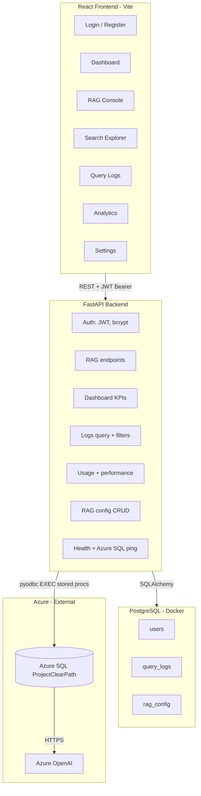
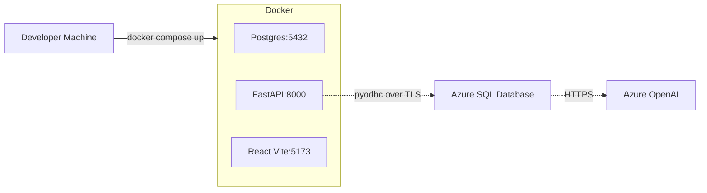

# ClearPath RAG — Architecture

## Overview

ClearPath RAG is a **full-stack clinical decision support platform** built on the Microsoft
**SQL AI in a Day** workshop. Retrieval and generation live **inside Azure SQL Database** via
stored procedures — the FastAPI backend wraps those procedures with a secure REST API and
audit trail; the React frontend provides the clinician and admin experience.

## High-Level Diagram

## Two-Database Pattern

This is an industry-standard separation of concerns:

| Concern | Database | Rationale |
|--------|----------|-----------|
| Clinical cases, embeddings, RAG pipeline | **Azure SQL** | Source of truth for domain data; native vector + full-text + external model support |
| Users, sessions, query audit, runtime config | **PostgreSQL** | App metadata lives in a portable RDBMS; survives Azure SQL migrations; cheap local dev |
| Auth (JWT signing key, secrets) | env / secret manager | Never in the database |

The FastAPI backend **does not reimplement RAG** — it forwards to existing stored procedures
and records every call. This means the workshop's lab SQL continues to work unchanged.

## Key Modules

### Backend (`backend/app/`)

| Module | Responsibility |
|--------|----------------|
| `main.py` | FastAPI app, CORS, rate limiting, health endpoint |
| `core/config.py` | pydantic-settings config from `.env` |
| `core/security.py` | bcrypt hashing, JWT encode/decode |
| `db/azure_sql.py` | pyodbc connection context manager |
| `db/session.py` | SQLAlchemy session for PostgreSQL |
| `models/` | `User`, `QueryLog`, `RagConfig` ORM models |
| `schemas/` | Pydantic request/response shapes |
| `services/rag_service.py` | Calls stored procedures, parses multi-result sets |
| `services/auth_service.py` | Register, authenticate, fetch users |
| `services/analytics_service.py` | KPIs, daily usage, latency percentiles |
| `api/v1/` | Route handlers grouped by domain |
| `scripts/seed_admin.py` | First-run admin + RAG config seed |

### Frontend (`frontend/src/`)

| Path | Purpose |
|------|---------|
| `lib/api.ts` | Axios instance + JWT interceptor |
| `contexts/AuthContext.tsx` | Login, register, current user, logout |
| `components/layout/AppShell.tsx` | Sidebar + top bar shell |
| `components/ui/*` | shadcn-style primitives (Button, Card, Input, etc.) |
| `pages/*` | One page per top-level nav item |

## RAG Pipeline (Azure SQL)

1. **Query embedding** — `AI_GENERATE_EMBEDDINGS` produces a vector using the configured
   external Azure OpenAI model (`text-embedding-3-small`).
2. **Vector search** — Cosine similarity over the `ClinicalCaseEmbeddings` vector index
   (Lab 5 procedure: `usp_FindSimilarClinicalCases`).
3. **Keyword search** — `CONTAINS` / `FREETEXT` over the full-text catalog
   (Lab 1 setup + Lab 6 procedure: `usp_RRFSearchClinicalCases`).
4. **Hybrid retrieval (RRF)** — Reciprocal Rank Fusion of vector + keyword rankings.
5. **Generation** — GPT-4o call (external model in SQL) produces a clinical summary
   grounded in the retrieved cases (Lab 7 procedure: `usp_ClearPath_RAG_Search`).

The web app's job is to:

- Pass clinician input to the stored procedure with sane defaults.
- Capture the retrieved cases and the generated summary.
- Persist the call (parameters + latency + status) to `query_logs`.
- Surface failures with the original error from the SQL SP.

## Security Model

- **JWT (HS256)** with a server-side `SECRET_KEY`; access tokens valid for 24 hours.
- **bcrypt** for password hashing (`passlib`).
- **CORS** restricted to the configured frontend origin(s).
- **Rate limiting** (`slowapi`) on `/rag/query` — 10 req/min per IP.
- **No Azure SQL credentials reach the browser** — they live in backend env only.
- **Role-based access** — `admin` can update `rag_config`; both roles can query and view logs.
- **Defense in depth** — every stored procedure call is wrapped in try/except and logged
  with error message; the frontend never sees stack traces.

## Deployment Topology

In production you would:

- Replace the dev frontend container with a static build behind a CDN or App Service.
- Replace the FastAPI container with Azure Container Apps or App Service.
- Move PostgreSQL to Azure Database for PostgreSQL Flexible Server.
- Move secrets to Azure Key Vault and reference via managed identity.

## Observability

- **Structured JSON logs** from `structlog` (backend).
- **Dashboard KPIs** — queries today, avg latency, success rate, Azure SQL connectivity.
- **Per-query audit trail** in `query_logs` (who, what, when, how long, success/error).
- **Analytics endpoints** — daily usage, by-type distribution, p50/p95 latency.
- **`/health`** endpoint pings Azure SQL with `SELECT 1`.

## Why This Shape?

- **No app-side RAG logic** keeps the lab SQL authoritative.
- **Stored procedures are testable** in isolation with `tsql` or SSMS.
- **Two-database split** keeps app and domain concerns independent.
- **JWT + role enum** is a familiar industry pattern; trivially extendable to OAuth/SSO later.
- **TypeScript end-to-end** (Pydantic ↔ TS types) catches contract drift at compile time.