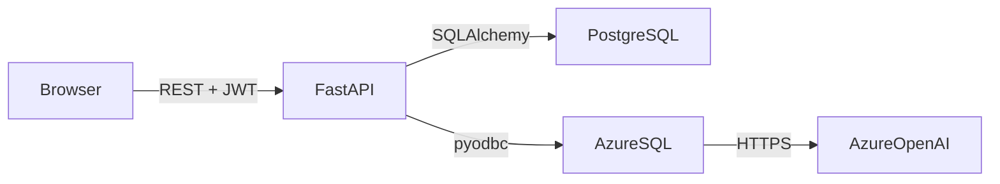

## ClearPath RAG — Project Overview

This is **ClearPath**, a full-stack clinical decision support platform built around a **hybrid RAG pipeline that runs inside Azure SQL Database**. The app doesn’t implement retrieval logic in Python — it calls Azure SQL stored procedures that do the embedding, vector search, keyword search, RRF fusion, and GPT-4o generation.

---

## Architecture

### High-level flow



### Two databases

| Database | Purpose |
|---|---|
| **Azure SQL** (`ProjectClearPath`) | Clinical cases, embeddings, vector index, full-text catalog, and 3 stored procedures that implement the entire RAG pipeline |
| **PostgreSQL** | App metadata: users, query audit logs, and live RAG configuration |

### Why this split?
- Azure SQL has native `VECTOR(1536)`, `VECTOR_SEARCH`, `AI_GENERATE_EMBEDDINGS`, and `sp_invoke_external_rest_endpoint` — so the AI pipeline lives where the data lives.
- PostgreSQL handles standard relational app concerns (auth, logs, config) cheaply and portably.

---

## Main Components

### Backend (app)
| Module | Role |
|---|---|
| main.py | FastAPI app, CORS, rate limiting, health check |
| `core/config.py` | Environment-based settings (.env) |
| `core/security.py` | bcrypt hashing, JWT encode/decode (HS256, 24h) |
| `db/azure_sql.py` | pyodbc connection to Azure SQL |
| `db/session.py` | SQLAlchemy session for PostgreSQL |
| `services/rag_service.py` | Calls 3 stored procedures: `usp_FindSimilarClinicalCases`, `usp_RRFSearchClinicalCases`, `usp_ClearPath_RAG_Search` |
| `services/auth_service.py` | Register, login, password verification |
| `services/analytics_service.py` | KPIs, daily usage, latency percentiles |
| `api/v1/rag.py` | RAG endpoints with rate limiting (10/min) |
| `api/v1/auth.py` | Register/login/me |
| `api/v1/logs.py` | Paginated query audit trail |
| `api/v1/analytics.py` | Usage + performance analytics |
| `api/v1/dashboard.py` | Dashboard KPIs |

### Frontend (src)
| Page | Purpose |
|---|---|
| `/login`, `/register` | Authentication |
| `/app/dashboard` | Clinician/admin overview |
| `/app/rag` | **RAG Console** — submit patient description + keyword, get grounded cases + GPT-4o summary |
| `/app/chat` | Chat interface |
| `/app/search` | **Search Explorer** — side-by-side vector vs hybrid (RRF) search with live sliders |
| `/app/logs` | Query audit trail with filters |
| `/app/analytics` | Recharts visualizations of usage, latency, by-type breakdown |
| `/app/settings` | Admin-only live RAG config editor |

---

## The RAG Pipeline (5 steps, all in Azure SQL)

1. **Embed** — `AI_GENERATE_EMBEDDINGS` turns the question into a 1536-dim vector
2. **Vector search** — cosine similarity over the `ClinicalCaseEmbeddings` index
3. **Keyword search** — `CONTAINSTABLE` over the full-text catalog
4. **RRF fusion** — Reciprocal Rank Fusion combines both rankings with configurable weights (`vector_weight=0.6`, `keyword_weight=0.4`, `rrf_k=60`)
5. **Generation** — GPT-4o answers strictly from the retrieved cases

---

## How to Use It

### Prerequisites
- Docker Desktop
- Azure SQL Database named `ProjectClearPath` with schema from sql applied
- Azure OpenAI with `text-embedding-3-small` and `gpt-4o` deployments

### Quick start (Docker)

```bash
# 1. Set environment variables in .env
# 2. Start everything
docker compose up

# Frontend: http://localhost:5173
# Backend:  http://localhost:8000
# API docs: http://localhost:8000/docs
```

### Key environment variables
- `DATABASE_URL` — PostgreSQL connection
- `AZURE_SQL_CONNECTION_STRING` — Azure SQL ODBC connection
- `SECRET_KEY` — JWT signing key
- `AZURE_OPENAI_ENDPOINT` / `AZURE_OPENAI_API_KEY` — for Azure SQL external model calls
- `CORS_ORIGINS` — allowed frontend origins

---

## Usage Scenarios

### 1. Clinician querying similar cases
Go to **RAG Console**, enter a patient description (e.g., *"62-year-old male with chest pain radiating to left arm, ECG shows ST elevation"*) and a keyword hint (e.g., *"myocardial infarction"*). The system returns:
- Top matching clinical cases with similarity scores
- A GPT-4o clinical summary grounded in those cases

### 2. Comparing search strategies
Go to **Search Explorer**:
- **Vector tab** — pure semantic similarity search
- **Hybrid tab** — RRF fusion of vector + keyword search
- Adjust weights with sliders to see how results change

### 3. Admin tuning RAG defaults
Go to **Settings** (admin only) to edit:
- `top_n` — how many cases to retrieve
- `vector_weight` / `keyword_weight` — RRF balance
- `rrf_k` — RRF smoothing constant
- `embedding_type` — FullCase, DiagnosisOnly, or ChiefComplaintOnly

### 4. Auditing queries
Go to **Logs** to filter by status (success/error), query type (rag/vector/hybrid), and see latency, user, and parameters for every query.

### 5. Monitoring platform health
Go to **Analytics** for daily usage charts, latency percentiles (p50/p95), and by-type breakdowns. The `/health` endpoint also pings Azure SQL directly.

---

## Tech Stack Summary

| Layer | Technology |
|---|---|
| Frontend | React 19, Vite, TypeScript, Tailwind v4, Radix UI, Recharts |
| Backend | FastAPI, SQLAlchemy, Alembic, pyodbc, structlog |
| AI/Data | Azure SQL (vector + FTS), Azure OpenAI (embeddings + GPT-4o) |
| Auth | JWT (HS256), bcrypt, RBAC (`admin` / `clinician`) |
| Infra | Docker Compose, PostgreSQL 16 |